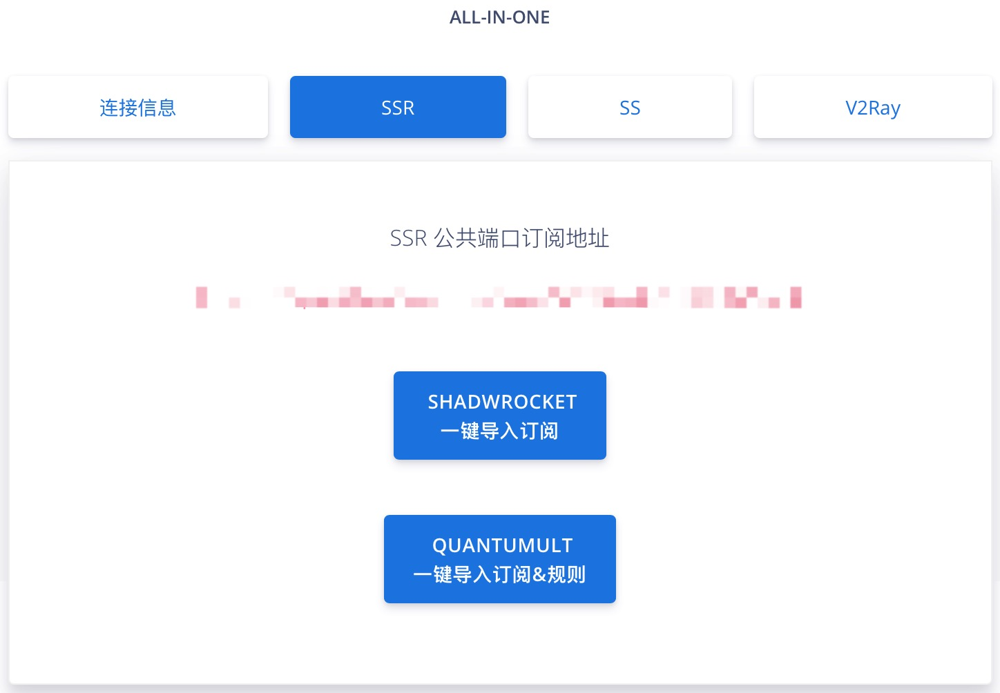
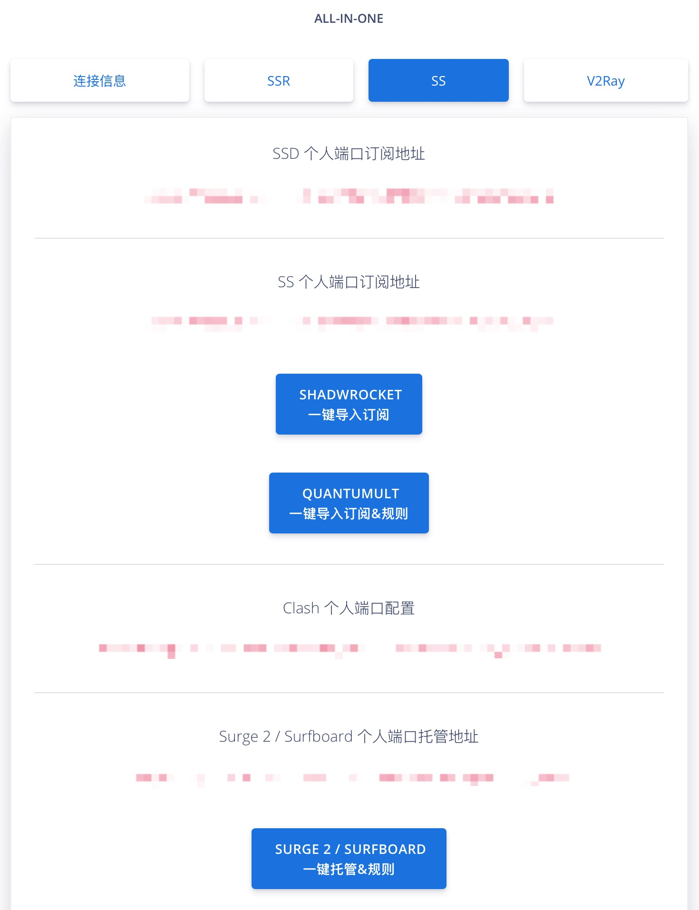
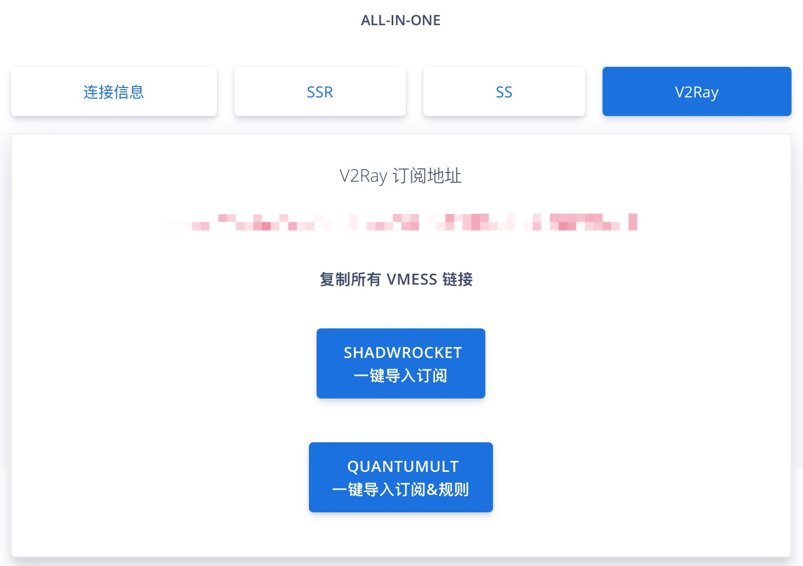

# 订阅地址 & 托管地址


阁下应当把订阅地址和托管地址当做密码一样妥善保管，请勿泄露给他人！



Surge/Clash 使用「托管模式」是目前最推荐且最方便的方式

* Surge 每 24 小时会自动尝试更新节点 & 规则，同时您也可以手动来立即更新节点信息。
* Clash 每次启动时会自动尝试更新节点 & 规则，同时您也可以手动来立即更新节点信息。



Shadowsocks/ShadowsocksR/ShadowsocksD 使用「订阅模式」，客户端在每次启动时自动尝试更新节点列表，同时您也可以手动来立即更新节点信息。


「dlercloud.com」用户中心

  

  

