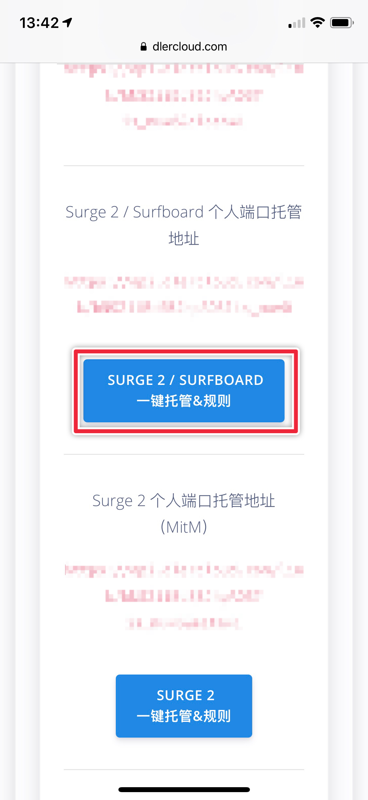
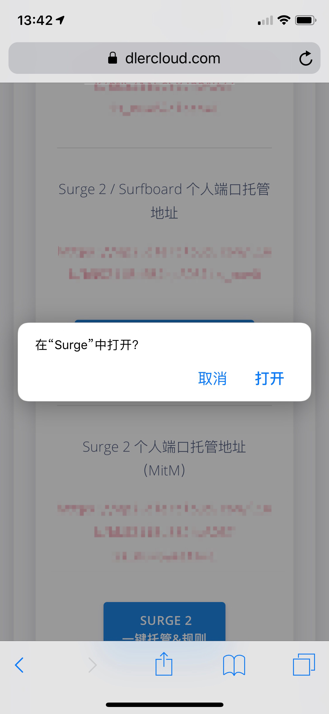
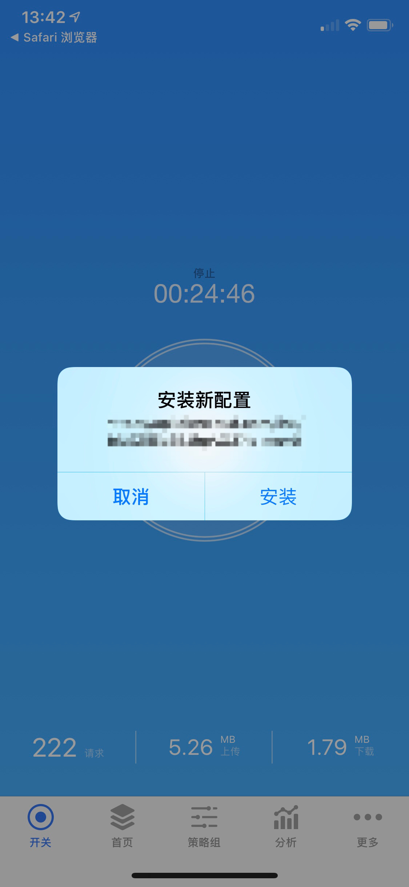

# Surge

* `系统要求：iOS 9 及以上`
* `软件版本：Surge 2 / 3 Pro`
* `设备要求：iPhone / iPad`


此应用已在国区下架，请自行准备非国区 Apple ID 下载。

Surge 不兼容 SSR 协议，推荐切换为 SS 模式使用


1. 登入 dlercloud.com 用户中心
2. 找到 ALL-IN-ONE 模块
3. 点击 Menu 中的 SS
4. 点击\[一键托管\]按钮（新手或轻量化用户推荐导入：**Surge 2 / Surfboard 个人端口托管地址**）

