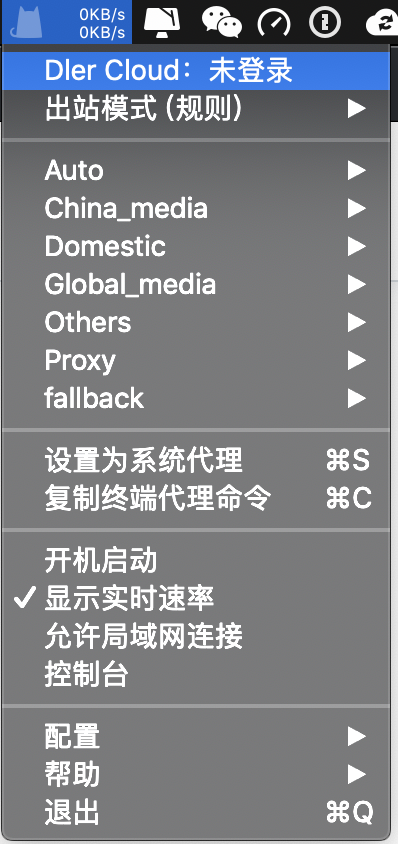
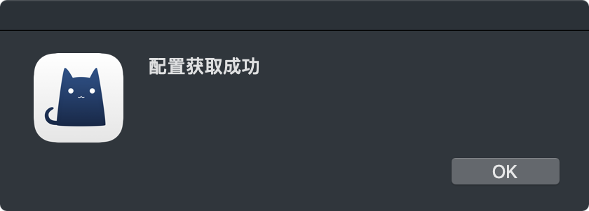

# ClashX（专属）

* `系统要求：macOS 10.5 及以上`
* `设备要求：MacBook / iMac / Mac Pro`


ClashX 不兼容 SSR 协议，推荐切换为 SS 模式使用



首次使用 ClashX 时，macOS 会提醒你此应用来自未知开发者，请允许打开此应用。

ClashX 首次运行会提示是否安装帮助程序（Helper）。此帮助程序用于设置系统代理，否则每次你通过 ClashX 变更系统系统状态（打开或关闭）时都需要输入密码，请点击「Install」，之后 macOS 会提示输入用户密码。


1. 从右上角的状态栏找到 ClashX 图标并进行鼠标右键，左键点击 \[Dler Cloud：未登陆\] ，输入 dlercloud.com 的邮箱/密码登陆
2. 等待弹出窗口：配置获取成功
3. 点击 \[设置为系统代理\] 即可
4. 5. 

