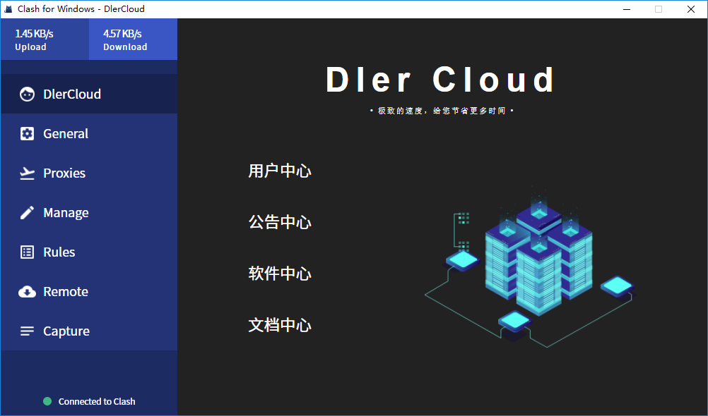
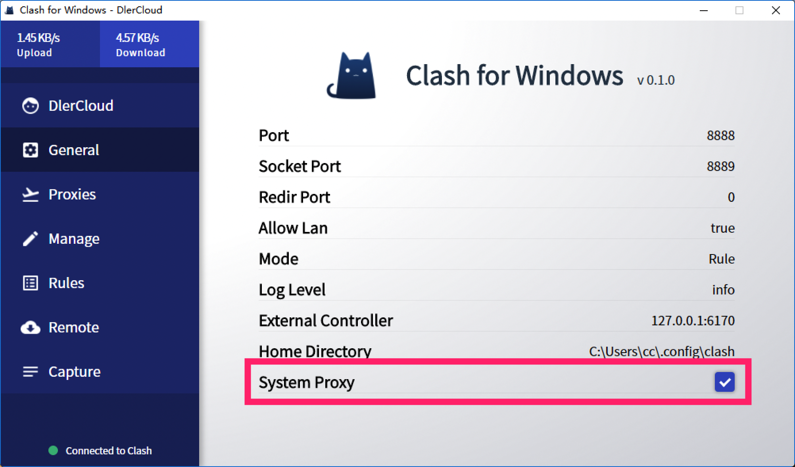

# Clash（专属）

* `系统要求：Windows XP 及以上（64-bit）`
* `设备要求：Windows PC / Tablet`


Clash 不兼容 SSR 协议，推荐切换为 SS 模式使用


1. 输入 dlercloud.net 的邮箱/密码登陆
2. 点击左侧菜单栏「General」并勾选「System Proxy」
3. 点击左侧菜单栏「Proxies」即可切换节点或模式


Windows 10 第一次运行会提示被阻止，点击「更多信息」 - 「仍要运行」


