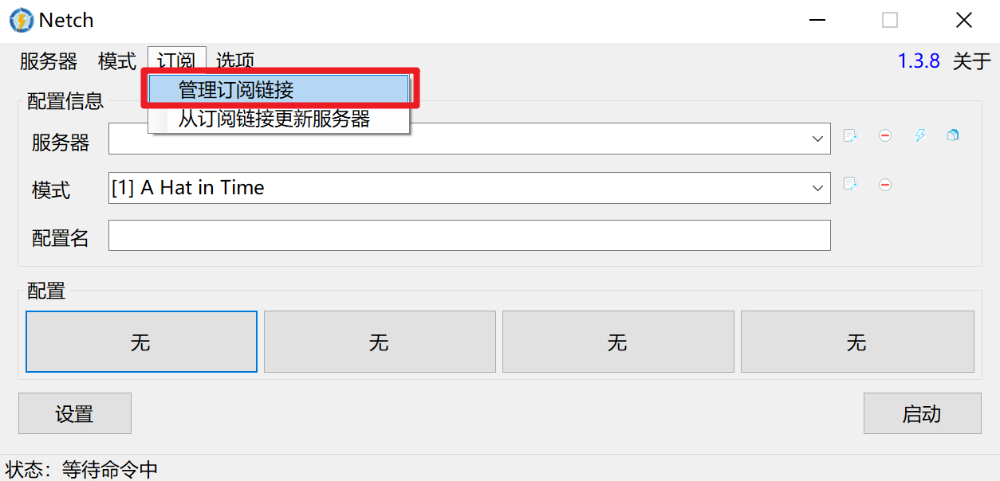

# Netch（游戏/特殊）

* `系统要求：Windows 7 及以上`
* `设备要求：Windows PC / Tablet`


尽管Netch 宣称为游戏而生，但SS / SSR 项目却并非为游戏设计的，其设计结构和很多代码实现都并不能提供足够优秀的游戏性能，Dler Cloud 仍然建议有游戏加速需求的用户使用专业的游戏加速器，

此外，如果你有使用BitTorrent 协议的需求（各类 BT/PT 下载），则应当避免在使用这些软件时开启Netch，否则BitTorrent 流量将有极大可能被Netch 路由通过Dler Cloud 网络，而Dler Cloud 的条款和条件中明确指出不允许在Dler Cloud 网络上使用BitTorrent 协议，否则将暂时或永久限制订阅或账户访问。


在用户中心的[Advanced](https://dlercloud.com/user#all_advanced) 找到Gamer 订阅地址

模式均为软件内置，配置文件请自行设置

